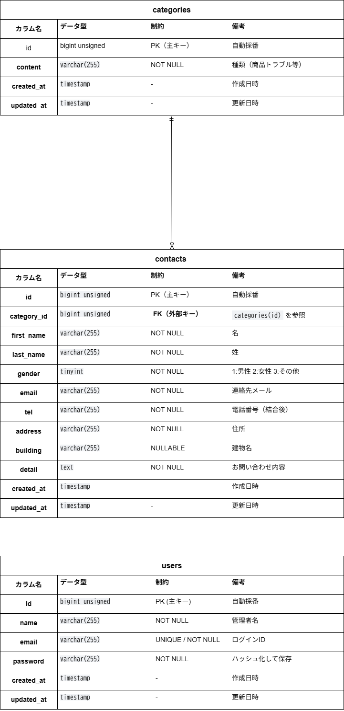

# お問い合わせフォーム

ユーザーが疑問・要望・不具合報告などに関するメッセージを、運営者に直接送信できる窓口です。

## 環境構築

#### リポジトリのクローン

```
git clone git@github.com:haru-school-task/laravel-contact-test.git
```

#### .env.exampleをコピーして設定ファイルを作成
コンテナ起動前ホスト側での準備。本プロジェクトは、Laravel本体が src ディレクトリ内に配置されています。

#### プロジェクトルートから src ディレクトリへ移動します

```
cd src
```

```
cp .env.example .env
```

#### .env ファイルの修正

```
DB_HOST=（ホスト名　※docker-compose.ymlのサービス名に合わせてください）
DB_DATABASE=（データベース名）
DB_USERNAME=（ユーザー名）
DB_PASSWORD=（パスワード）
```

### Dockerコンテナの起動

プロジェクトのルートディレクトリ（docker-compose.yml がある場所）に戻って実行します。

#### 一つ上の階層に戻る

```
cd ..
```

```
docker-compose up -d --build
```

【トラブルシューティング】
もし docker-compose up 後に MySQL が起動しない（docker-compose ps に表示されない）場合は、以下のコマンドでデータディレクトリをリセットしてください。

```
docker-compose down -v
rm -rf docker/mysql/data
docker-compose up -d
```

### コンテナ内での初期設定

#### Laravelパッケージのインストール

```
docker-compose exec php composer install
```

#### アプリケーションキーの生成

```
docker-compose exec php php artisan key:generate
```

#### データベースの構築と初期データの投入

```
docker-compose exec php php artisan migrate:fresh --seed
```

#### ディレクトリの権限設定（表示エラーが出る場合）
ブラウザでアクセスした際に「Permission denied」等のエラーが表示される場合は、コンテナ内で以下のコマンドを実行して所有者を修正してください。

```
docker-compose exec php chown -R www-data:www-data storage bootstrap/cache

docker-compose exec php chmod -R 775 storage bootstrap/cache
```

## 使用技術（実行環境）

フレームワーク：Laravel 8.75 / Fortify 1.x

言語：PHP 8.0.x / JavaScript

Webサーバー：Nginx 1.21

データベース：MySQL 8.0.26

## ER図



## URL

アプリケーション：http://localhost/

管理画面：http://localhost/admin

phpMyAdmin：http://localhost:8080/

### ログイン・動作確認について
本リポジトリは初期状態でデータベースをリセット済みです。
管理画面の動作確認を行う際は、以下の手順で進めてください。

1. `/register` にアクセスし、任意のメールアドレス・パスワードで管理者登録を行う
2. 登録完了後、自動的にログインされ管理画面（`/admin`）へ遷移します
3. 以降は登録した情報で `/login` よりログイン可能です

### 認証・ユーザー機能について
本アプリでは、機能要件に基づき以下のように実装しています。

- **一般ユーザー（顧客）**: 
  - ログイン不要でお問い合わせフォームを利用可能です。
  - 送信完了後、HOMEボタンよりフォーム入力画面へ戻ることができます。
- **管理者**: 
  - Fortifyによる新規登録・ログイン・ログアウト機能を備えています。
  - ログイン後、専用の管理画面にてお問い合わせデータの検索・閲覧・CSV出力が可能です。


## 仕様・設計に関する調整
実務上の利便性とデータの整合性を考慮し、以下の箇所を調整して実装いたしました。

- **電話番号のバリデーション**:
  仕様書に一部「半角英数字」との記述がありましたが、電話番号の性質上、英字が含まれることは不適切と判断し、一貫して「半角数字」のみを許可する設定としました。
- **カラム名のタイポ修正**:
  仕様書の `categry_id` は `category_id` のタイポと判断し、プログラムの可読性および将来のメンテナンス性を考慮して、標準的なスペルである `category_id` に修正いたしました。

